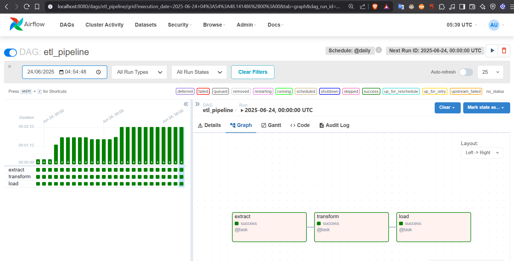

# **Actividad 24: Introduccion a Docker, ETL en Docker Compose**

Este proyecto implementa un pipeline ETL (Extract, Transform, Load) utilizando **Docker**, **Docker Compose** y **Apache Airflow**. El pipeline lee un archivo CSV (`input.csv`), calcula el cuadrado de los valores y carga los resultados en una base de datos PostgreSQL. El proyecto esta completamente dockerizado, con servicios para la aplicacion ETL, la base de datos y Airflow para orquestar el pipeline

## Instalacion y ejecucion

Sigue estos pasos para configurar y ejecutar el proyecto.

### 1. Clona el repositorio

```bash
git clone https://github.com/JunalChowdhuryG/Actividad-24.git
cd Actividad-24/Proyecto_etl_docker_airflow
```

### 2. Construye y arranca los servicios

Construye las imagenes de Docker y arranca los contenedores en modo detached:

```bash
docker-compose up -d --build
```

- **Que hace**:
  - Construye las imagenes para `etl-app` y los servicios de Airflow.
  - Inicia los contenedores: `postgres`, `etl-app`, `airflow-init`, `airflow-webserver` y `airflow-scheduler`.
  - Configura la base de datos PostgreSQL y el usuario administrador de Airflow (`admin`/`admin`).

[](img/docker-compose%20up%20-d%20--build.png)

### 3. Verifica los contenedores

Confirma que todos los contenedores estan en ejecucion:

```bash
docker ps
```


### 4. Monitorea los logs

Abre terminales adicionales para seguir los logs en tiempo real:

- **Webserver de Airflow**:
  ```bash
  docker-compose logs -f airflow-webserver
  ```
  

- **Scheduler de Airflow**:
  ```bash
  docker-compose logs -f airflow-scheduler
  ```
  

### 5. Accede a la interfaz de Airflow

1. Abre tu navegador en: [http://localhost:8080](http://localhost:8080).
2. Inicia sesion con:
   - **Usuario**: `admin`
   - **Contraseña**: `admin`


3. Navega a la vista principal de DAGs: [http://localhost:8080/home](http://localhost:8080/home).
4. Busca el DAG `etl_pipeline` y haz clic en el boton **Trigger DAG** (icono de reproduccion).


5. Observa como las tareas (`extract`, `transform`, `load`) se ejecutan secuencialmente en la vista **Graph** o **Grid**.



### 6. Verifica los datos en PostgreSQL

Para confirmar que los datos se han cargado correctamente en la base de datos:

```bash
docker exec -it proyecto_etl_docker_airflow-postgres-1 psql -U user -d etl_db -c "SELECT * FROM processed_data Limit 10;"
```

**Salida esperada**:
```
 id | name | value | value_squared
----+------+-------+---------------
  1 | A    |     1 |             1
  2 | B    |     2 |             4
  3 | C    |     3 |             9
  4 | A    |     1 |             1
  5 | B    |     2 |             4
  6 | C    |     3 |             9
  7 | A    |     1 |             1
  8 | B    |     2 |             4
  9 | C    |     3 |             9
 10 | A    |     1 |             1
(10 rows)
```

### 7. Detener y limpiar

Para detener y eliminar los contenedores, redes y volúmenes:

```bash
docker-compose down -v
```
